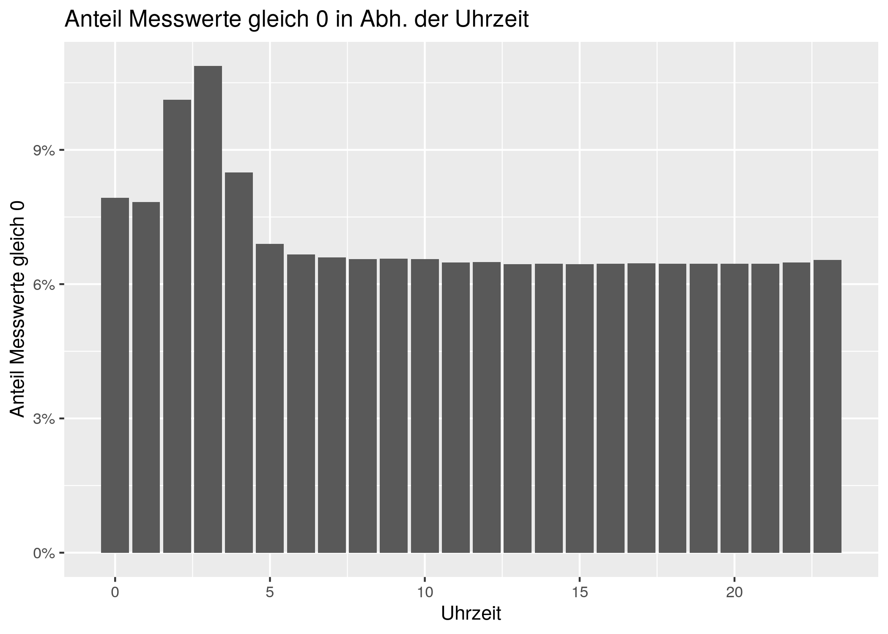
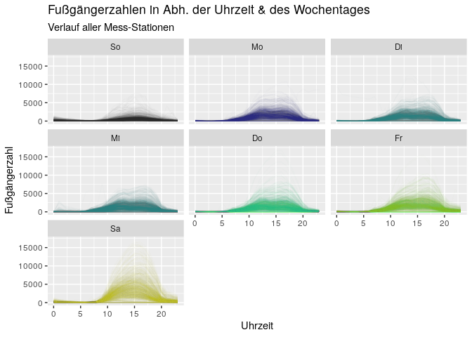
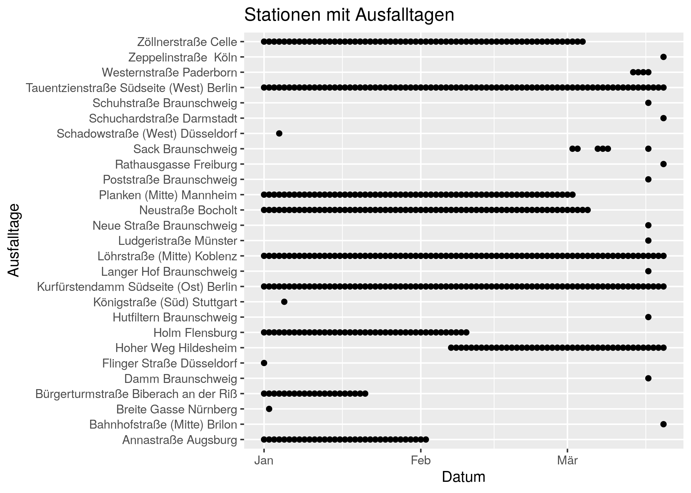
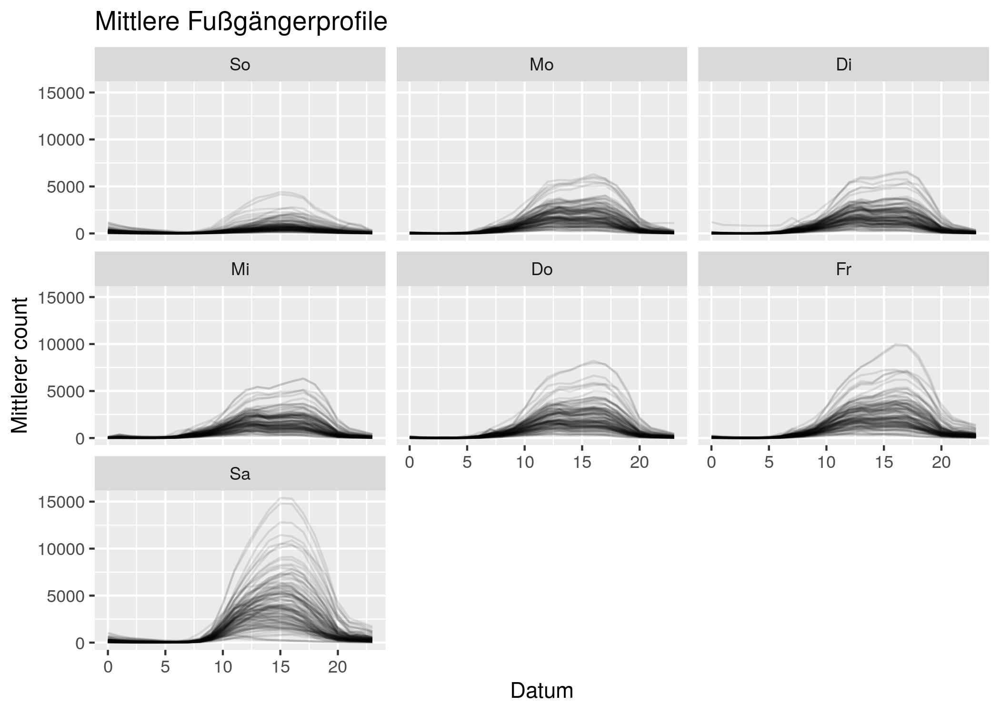

hystreet expl. data analysis
================
Urs Wilke
3/21/2020

## Gescrapete Daten laden

Die Daten kommen von <https://hystreet.com/>

``` r
load("~/R/socialdistancingdash/hystreet.RData") 

df <- 
  df %>% 
  mutate(hour = lubridate::hour(timestamp),
         wd = lubridate::wday(timestamp, label = TRUE),
         date = lubridate::date(timestamp),
         id = paste0(date, place)) 
df %>% as_tibble()
```

    ## # A tibble: 221,949 x 7
    ##    place    timestamp           pedestrians_cou…  hour wd    date       id      
    ##    <chr>    <dttm>                         <int> <int> <ord> <date>     <chr>   
    ##  1 Annastr… 2020-01-01 00:00:00                0     0 Mi    2020-01-01 2020-01…
    ##  2 Annastr… 2020-01-01 01:00:00                0     1 Mi    2020-01-01 2020-01…
    ##  3 Annastr… 2020-01-01 02:00:00                0     2 Mi    2020-01-01 2020-01…
    ##  4 Annastr… 2020-01-01 03:00:00                0     3 Mi    2020-01-01 2020-01…
    ##  5 Annastr… 2020-01-01 04:00:00                0     4 Mi    2020-01-01 2020-01…
    ##  6 Annastr… 2020-01-01 05:00:00                0     5 Mi    2020-01-01 2020-01…
    ##  7 Annastr… 2020-01-01 06:00:00                0     6 Mi    2020-01-01 2020-01…
    ##  8 Annastr… 2020-01-01 07:00:00                0     7 Mi    2020-01-01 2020-01…
    ##  9 Annastr… 2020-01-01 08:00:00                0     8 Mi    2020-01-01 2020-01…
    ## 10 Annastr… 2020-01-01 09:00:00                0     9 Mi    2020-01-01 2020-01…
    ## # … with 221,939 more rows

Im Datensatz sind 221949 Messwerte von 117 Stationen.

## EDA

### Anteil der Messwerte die 0 sind

Wahrschenlich waren an diesen Tagen die Sensoren nicht funktionstüchtig.

``` r
df %>% 
  group_by(hour) %>% 
  summarise(eq0 = sum(pedestrians_count == 0),
            n = n(),
            eq0_share = eq0 / n) %>% 
  ggplot(aes(hour, eq0_share)) +
  geom_col() +
  labs(title = "Anteil Messwerte gleich 0 in Abh. der Uhrzeit",
       x = "Uhrzeit",
       y = "Anteil Messwerte gleich 0") +
  scale_y_continuous(labels = scales::percent_format(accuracy = 1))
```

<!-- -->

``` r
df %>% 
  ggplot(aes(hour, pedestrians_count, color = wd, group = id)) +
  geom_line(alpha = 0.01) +
  facet_wrap(~wd) +
  theme(legend.position = "none") +
  labs(title = "Fußgängerzahlen in Abh. der Uhrzeit & des Wochentages",
       subtitle = "Verlauf aller Mess-Stationen",
       x = "Uhrzeit",
       y = "Fußgängerzahl")
```

<!-- -->

Die Messwerte sind an manchen Tagen durchgehend 0.

### Daten an den die jeweiligen Stationen nicht gemessen haben

``` r
df_ausfall <- 
  df %>% 
  group_by(place, date) %>% 
  summarise(ausfall = all(pedestrians_count == 0)) %>% 
  filter(ausfall) 
df_ausfall %>% 
  ggplot(aes(date, place)) +
  geom_point() +
  labs(title = "Stationen mit Ausfalltagen",
       x = "Datum",
       y = "Ausfalltage")
```

<!-- -->

### Mittelwerte der Fußgängerzahlen

  - Ausfalltage filtern
  - Nur Tage vor dem 1. März

<!-- end list -->

``` r
df_mean <- 
  df %>% 
  # Ausfalltage filtern:
  anti_join(df_ausfall) %>% 
  # Nur Tage vor dem 1. März:
  filter(date < "2020-03-01") %>% 
  group_by(place, wd, hour) %>% 
  summarise(mean_count = mean(pedestrians_count))
```

    ## Joining, by = c("place", "date")

``` r
df_mean %>% 
  ggplot(aes(hour, mean_count, group = place)) + 
  geom_line(alpha = 0.1) +
  facet_wrap(~wd) +
  labs(title = "Mittlere Fußgängerprofile",
       x = "Datum",
       y = "Mittlerer count")
```

<!-- -->

Die Mittelwerte schreibe ich in die Datei “mean\_count.csv”

``` r
write_csv(df_mean, "mean_count.csv")
```
