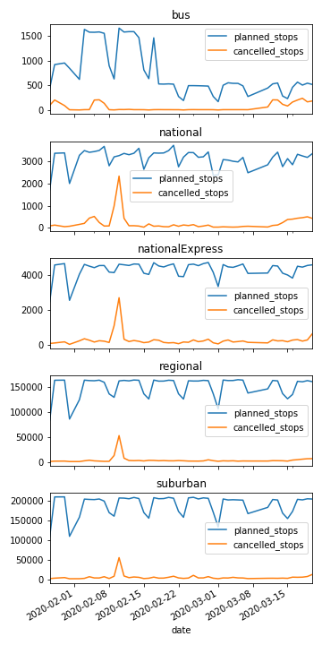

# Zugdaten summary

Dieser Ordner enthält das Script für den Zugdaten-Upload. Außerdem gibt es im Ordner summaries Zusammenfassungen (jsons) für jeden Tag. 

## Zeitraum
* Anfang des Uploads: 27.01.2020
* Ende des Uploads: (immer bis gestern)

##Missing values
* 2020-01-29 (da unvollständig)
* 2020-02-01 (fehlt)
* 2020-03-08 (fehlt)
* 2020-03-09 (fehlt)
* 2020-03-10 (fehlt)

##Daten liegen getrennt nach Zugtypen vor
* national
* nationalExpress
* regional
* suburban
* bus

##Welche Daten liegen vor
* Wie viele Zughalte hätte es je nach Kategorie geben SOLLEN
* Wie viele Zughalte hat es je nach Kategorie tatsächlich gegeben?

##Json Format
```json
{
  'date': '2020-03-01',
  'planned_stops': {
      'bus': 169,
      'national': 2379,
      'nationalExpress': 3359,
      'regional': 106760,
      'suburban': 132891
  },
  'cancelled_stops': {
      'bus': 0.0,
      'national': 35.0,
      'nationalExpress': 73.0,
      'regional': 1146.0,
      'suburban': 1202.0}
  }
}
```

## Visualisierung der Daten bis 2020-03-20

   
### Interpretation
* Man erkennt die Wochenenden als (planmäßige) Reduktion der geplanten Zughalte.
* Man erkennt einen starken Peak am 2020-02-08/09. Hier hat das Sturmtief Sabrina zugeschlagen
* Busse sind ab mitte Februar massiv eingeschränt worden (warum?)
* Man sieht (schwach) in den letzten Tagen einen Anstieg in den Ausfällen bei allen "Zugtypen". Hier kann man von Corona-bedingten Ausfällen ausgehen.