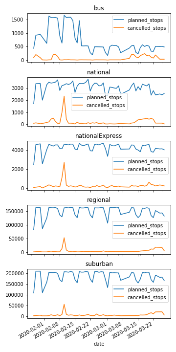

# Zugdaten summary

Dieser Ordner enthält für jeden Tag eine kurze Zugdaten Zusammenfassung in Form einer json Datei.

* Wie viele Züge hätten je Kategorie fahren SOLLEN
* Wie viele Züge sind je nach Kategorie tatsächlich gefahren

>{'date': '2020-03-01',
   'planned_stops': {'bus': 169,
   'national': 2379,
   'nationalExpress': 3359,
   'regional': 106760,
   'suburban': 132891},
  'cancelled_stops': {'bus': 0.0,
   'national': 35.0,
   'nationalExpress': 73.0,
   'regional': 1146.0,
   'suburban': 1202.0}}`

   
   